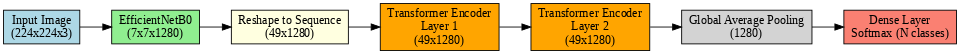

# 🚀 EffiTron: Hybrid CNN-Transformer Architecture for Multi-Class Image Classification using Tensorflow

EffiTron is a **novel hybrid model** that combines a **convolutional backbone** with a **Transformer encoder** to leverage both local and global feature extraction capabilities for robust and accurate **multi-class image classification** tasks.

---

## 🏗️ Architecture Overview
EffiTron integrates the best of both worlds:
- **EfficientNetB0 Backbone**: Captures fine-grained local spatial features from input images.
- **Transformer Encoder**: Models long-range dependencies by processing reshaped feature sequences into global contextual relationships.

---

## 🔎 Notation
- **𝐼 ∈ ℝᴴ×ᵂ×ᶜ** – Input image  
- **𝐹 ∈ ℝʰ×ʷ×ᵈ** – Output feature map from EfficientNetB0  
- **𝑇 ∈ ℝ(ʰ⋅ʷ)×ᵈ** – Reshaped sequence for Transformer input  
- **𝑑** – Feature depth (1280 for EfficientNetB0)  
- **𝑁** – Number of output classes  
- **𝐿** – Number of Transformer encoder layers  
- **𝐻** – Number of attention heads  

---

## 🔢 Parameter Calculation Summary
### 1️⃣ EfficientNetB0 Feature Extraction  
- **Output**: 𝐹 ∈ ℝ⁷×⁷×¹²⁸⁰  
- **Parameters**: ~5.3M (pre-trained; can be frozen or fine-tuned)  

### 2️⃣ Sequence Reshaping  
- 𝑇 = Reshape(𝐹) ∈ ℝ⁴⁹×¹²⁸⁰  

### 3️⃣ Transformer Encoder Block
- **Multi-Head Self-Attention (MHSA)**:  
  Parameters per layer: ~6.5M  
- **Feed-Forward Network (FFN)**:  
  Parameters per layer: ~655.8K  
- **Total per Transformer layer**: ~7.1M  
- **Total for 2 layers**: ~14.2M  

### 🔚 Final Classifier
- Parameters: ~1280×N + N  

---

## 🖼️ Architecture Diagram
📌 

---

## 📂 Repository Highlights
✅ **Hybrid CNN-Transformer architecture** for robust feature extraction  
✅ **Multi-class classification support** with configurable parameters  
✅ **EfficientNetB0 backbone** with **Transformer encoder** for superior performance  
✅ Well-documented architecture and implementation  

---

## 🛠️ Dependencies
- TensorFlow 2.x  
- NumPy  
- Matplotlib *(for visualization)*  
- *(Optional)* Pre-trained EfficientNetB0 weights  

